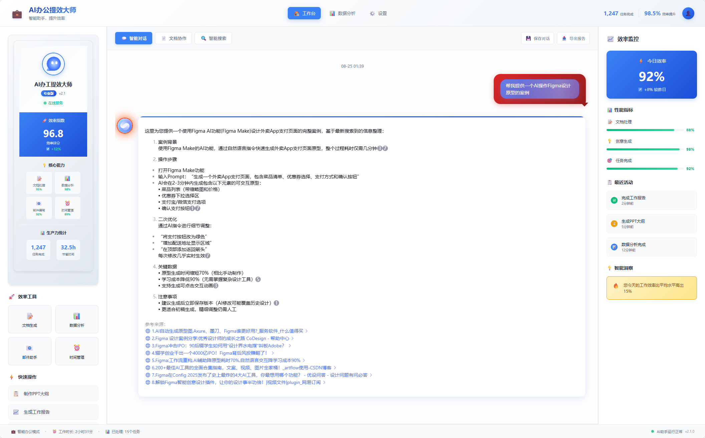
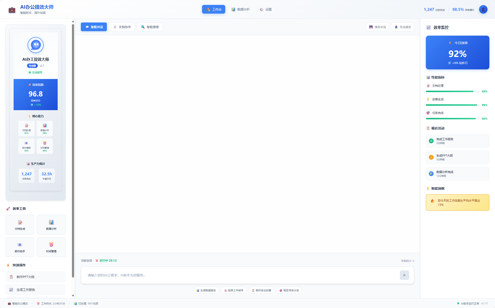

# 超级辩论大师 - 专业辩论训练平台

## 掌握辩论的艺术

超级辩论大师是一款革新性的AI驱动辩论训练系统，专为渴望提升思辨能力和论证技巧的现代辩论者量身定制。在这个信息爆炸、观点碰撞的时代，拥有清晰的逻辑思维和有力的表达能力比以往任何时候都更加重要。我们深知，优秀的辩论技能不仅能帮助您在学术讨论中脱颖而出，更能在职场沟通、公共演讲和日常交流中展现非凡的说服力。

通过整合最前沿的人工智能技术和丰富的辩论理论知识，超级辩论大师为每位用户提供个性化的辩论训练方案。无论您是初入辩论殿堂的新手，还是经验丰富的资深辩手，或是希望在公众演讲中更具说服力的专业人士，我们都能为您的每一次思辨训练提供专业而深入的指导，让辩论成为您思维锐利的武器。

## 专业辩论训练体验

### 智能论证构建系统

超级辩论大师的核心优势在于其强大的论证分析和构建能力。当您向系统提出一个辩论主题或观点时，我们的AI会即时分析该话题的多个维度，包括历史背景、相关数据、不同观点的论证基础以及可能的反驳角度。系统不仅会帮助您理清论证的逻辑链条，更会为您提供有力的事实支撑和精准的数据引用，让您的每一个观点都站得住脚。

我们的AI辩论导师具备深度的逻辑分析能力，能够识别论证中的逻辑漏洞，指出推理过程中的薄弱环节，并提供针对性的改进建议。从三段论的经典结构到现代论证理论的复杂模型，系统都能为您提供专业的指导，帮助您构建无懈可击的论证体系。

### 全方位辩论技能培养

超级辩论大师不仅是一个论证分析工具，更是您全面提升辩论技能的训练营。我们的智能系统涵盖了辩论的每一个关键要素，从开场陈述的震撼力到结束总结的说服力，从反驳技巧的犀利性到防守策略的稳固性，为您提供系统性的辩论能力提升方案。

在论据收集方面，系统会引导您如何有效搜集和筛选支持材料，区分一手资料和二手资料的价值，评估数据来源的权威性和可靠性。在逻辑分析方面，我们会训练您识别各种逻辑谬误，掌握演绎推理和归纳推理的正确运用，学会在复杂议题中理清因果关系和相关性。

我们独特的参考来源验证系统确保您获得的每一条论据都经得起推敲。当系统为您推荐某个论点或数据时，会自动标注信息来源、发布时间和权威度评级，让您能够建立可信度极高的论证基础。这种透明化的信息展示不仅提升了论证的说服力，更培养了您严谨的学术态度。

## 前沿技术架构

### 创新的辩论界面设计

超级辩论大师采用了全新的三栏式专业辩论界面，完全摆脱了传统教学软件枯燥单一的设计理念。左侧导航栏采用庄重的深红色配色方案，象征着辩论的激情与理性并存，清晰地组织了辩论训练、论据库、逻辑分析和表现统计等核心功能模块。这种设计不仅提升了功能的易用性，更营造出专业辩论培训机构的权威氛围。

中央主内容区域采用现代化的师生对话设计，用户的提问以红色渐变气泡形式展现，象征着思辨的火花和论证的力量。AI导师的回复则以精美的白色卡片形式呈现，顶部装饰着象征胜利的红色渐变条，每一次交流都如同与资深辩论教练的深度研讨。右侧指导面板实时展示辩论技巧、热门辩题和论证方法，为用户提供持续的学习支持。

### 智能化辩论交互

平台基于Vue.js 2框架构建，融合CSS Grid布局技术，实现了高度专业的用户体验。在大屏幕环境下，用户可以同时查看论证结构、参考资料和实时指导；在移动设备上，界面会智能简化为专注模式，突出核心的辩论对话功能，确保随时随地都能进行高质量的辩论训练。

输入框设计体现了辩论的严谨性，采用专业的磨砂质感和动态边框效果。当用户聚焦思考时，边框会呈现流动的红色能量效果，激发思辨的热情。发送按钮采用盾牌造型设计，象征着坚固的论证防线，每次点击都伴随着自信的动画效果。

系统后端采用Node.js架构，支持WebSocket和Server-Sent Events双重通信协议，确保辩论过程的实时性和流畅性。我们整合了多个权威的学术数据库和事实核查平台API，为用户提供最准确、最权威的论据支持。同时，系统实现了智能论证分析引擎，能够实时评估论证的逻辑强度和说服力。

## 用户体验革新

### 专业化视觉识别

超级辩论大师在视觉设计上完全突破了传统教育软件的设计局限，采用了象征理性与激情的红色主题配色。从深红到亮红的渐变色调不仅传达出辩论的力量感，更能激发用户的思辨热情和胜负欲。剑与盾的图标组合巧妙象征着攻守兼备的辩论策略，与"超级辩论大师"的定位完美呼应。

界面中的每个视觉元素都经过精心雕琢，从锐利的边角设计到渐变的色彩过渡，从动态的效果展示到静态的内容布局，都体现了对专业辩论训练场景的深度理解。这种富有张力的设计风格不仅让用户在使用过程中保持专注，更能激发他们在辩论中的竞争意识和求胜欲望。

### 智能化训练流程

平台的交互设计充分考虑了辩论训练的专业需求和学习规律。当用户输入辩论主题或观点时，系统会显示"正在构建强有力的论证..."的提示，让用户感受到AI正在调动庞大的知识库和推理能力，为他们量身定制最优的论证策略。系统的回复不仅包含具体的论证建议，还会附上相关的学术文献和权威资料，用户可以进一步深化对话题的理解。

系统支持多回合深度辩论，能够记住用户的观点倾向和论证风格，在持续的交流中提供越来越精准的指导。用户可以随时调整论证角度、更换辩论立场或深化某个论点，系统会实时调整策略并提供新的思路和角度。

### 个性化能力提升

超级辩论大师的训练系统不仅基于通用的辩论理论，更能根据每个用户的特点制定个性化的提升方案。系统会分析用户的论证风格、逻辑偏好和表达习惯，识别出个人在辩论技能上的优势和短板，从而在后续训练中提供更加针对性的建议和练习。

右侧指导面板的内容会根据用户的训练进度和能力水平进行动态调整。如果用户在逻辑推理方面较为薄弱，系统会增加相关的理论讲解和实战练习；如果用户在数据运用方面需要加强，则会推送更多的统计分析技巧和案例研究。这种智能化的个性辅导让每个用户都能获得最适合自己的训练体验。

## 技术创新与突破

超级辩论大师在技术实现上融合了多项前沿技术和教育理念。前端采用响应式设计架构，确保在各种设备上都能提供一致的专业体验。CSS3动画系统的精准运用为用户营造了充满活力的辩论氛围，从页面转场到按钮响应，每一个交互细节都经过精心打磨。

在智能分析方面，系统集成了自然语言处理、逻辑推理和知识图谱等多项AI技术，能够深度理解用户的论证意图，识别论证结构的优劣，并提供专业水准的改进建议。实时论证评估系统能够从多个维度对用户的表现进行量化分析，包括逻辑连贯性、论据充分性、表达清晰度等关键指标。

知识库系统的深度整合让超级辩论大师拥有了海量的论证素材和案例资源。无论是经典的哲学辩题还是当下的社会热点，系统都能提供相关的背景资料、不同观点的论证思路以及历史上的经典论战案例。多维度的信息检索和智能推荐功能确保用户总能找到最相关、最有价值的参考材料。

超级辩论大师代表了AI辅助辩论教育的新高峰，通过技术创新和教育理念的完美融合，为现代辩论学习者提供了一个真正专业、高效的训练平台。我们相信，借助人工智能的强大能力，每一个热爱思辨的人都能够掌握更加犀利的论证技巧，在思想的交锋中展现出令人震撼的说服力。